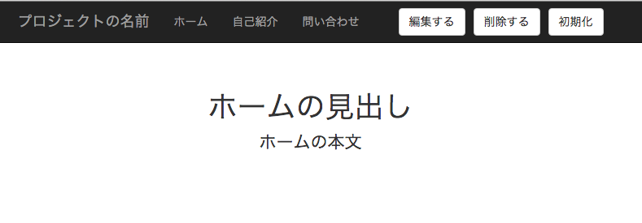
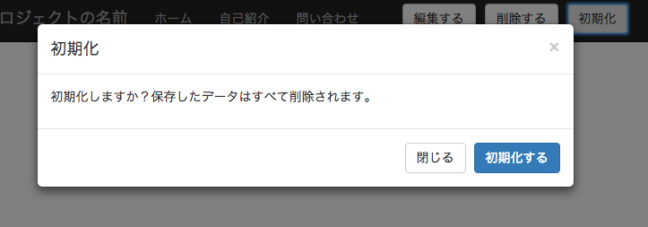
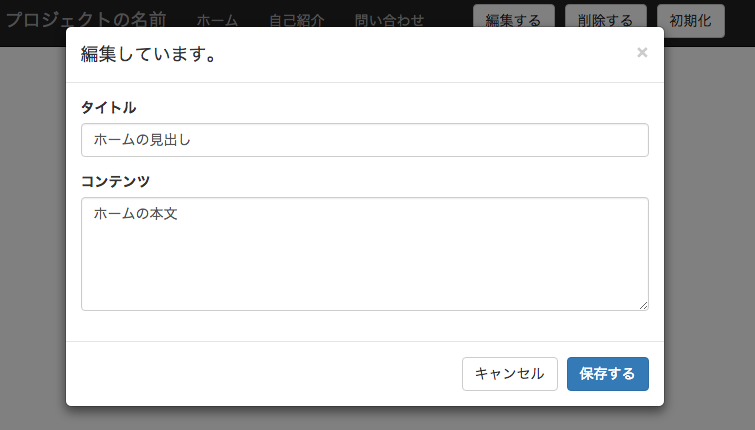

Backbone.js と Silex による Single Page Application (SPA) の例
=============================================================

Backbone.js と Silex による Single Page Application (SPA) の例です。ページの移動に際して、コンテンツのみを Ajax で取得するので、ページの表示が速くなります。HTML5 の History API のおかげで、たとえば、`/#about` が `/about` としてブラウザーの URL　バーに表示されます。


スクリーンショット
---------------



環境
----

PHP のビルトインサーバーで動作を確認しています。


インストール
-----------

```bash
git clone https://github.com/masakielastic/silex-backbone-example.git
cd silex-backbone-example
composer update
```

PHP のビルトインサーバーを起動させます。

```bash
php -S localhost:3000 -t web web/index.php
```

アプリの動作確認
-------------

最初に必要なことはページがページが表示されるようにデータベースを初期化します。「初期化」のボタンを押して初期化を実行します。初期化が終えたらページをリロードします。



今度はページを編集してみましょう。「編集」ボタンをクリックしてモーダルを表示させます。


